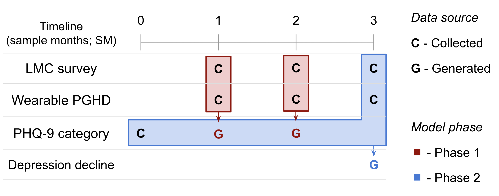
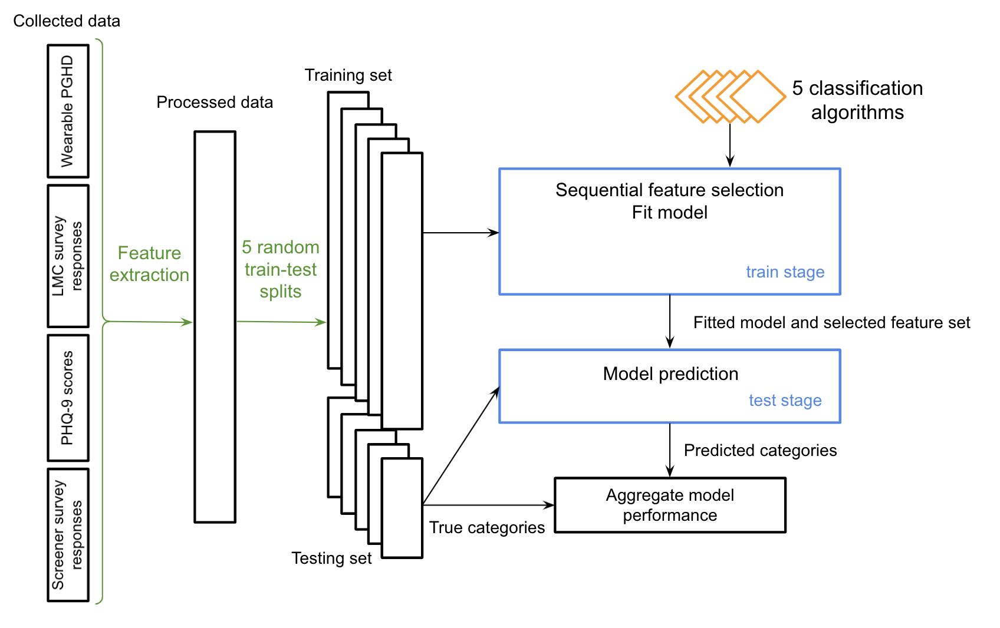

# PSYCHE-D: Predicting change in depression severity using person-generated health data

[](https://creativecommons.org/licenses/by-nc/4.0/)

PSYCHE-D (Predicting SeveritY CHangE in Depression) is a two-phase multi-class classification model that predicts longitudinal changes in depression severity using person-generated health data in the form of survey responses and consumer wearable sleep and step data. This repository contains code that can be used to replicate the results presented in ["PSYCHE-D: predicting change in depression severity using person-generated health data" DOI].

### Abstract

Depression is a common and serious condition, affecting an increasingly large number of individuals worldwide. Despite a range of treatment options, a large fraction of individuals experiencing worsening depression do not seek or receive treatment.
Person-generated health data (PGHD), including self-reports and consumer-grade wearable technology, provide a window into the everyday lives of individuals. Such information could be used as a basis for a low-burden, unobtrusive system that recognizes, and enables engagement and interaction with, individuals who are likely to be experiencing worsening depression. In this work, we present PSYCHE-D (Prediction of SeveritY CHangE - Depression), a two-phase multi-class classification model that predicts longitudinal change in depression severity. As the data collected by our low-burden approach is quite sparse, the first phase consists of populating the dataset with intermediate depression severity labels. These labels, in addition to the self-reported ones, are used as inputs for the second phase, where we predict whether there is an increase in depression severity over a 3-month period. Using a randomized splitting strategy, we obtained a sensitivity of 88.2% when predicting increase in depression severity. When performing subject-based splitting for training and testing, we obtained a sensitivity of 87.0%.
PSYCHE-D provides proof-of-principle for using PGHD as a low burden basis for predicting longitudinal changes in depression severity. PSYCHE-D is not only developed using large-scale input, but demonstrates feasibility for scaling and deployment by showing that the model is performant even on unseen individuals. Future work will focus on independent, prospective validation, incorporation of other sources of input, and extension to other mental health conditions like anxiety and stress.

### Dataset requirements

The input data required to generate 3-month training/testing samples for the model are:

- Screener and baseline survey responses: socio-demographic information, comorbidities and health status at enrollment
- Lifestyle and medical changes (LMC) survey responses: self-reported changes over the past month, including starting a new medication, increased physical activity or reduction in alcohol consumption
- PHQ-9 survey responses
- Wearable PGHD: sleep and step data from a consumer wearable, aggregated at day-level

The following figure summarizes the data required to generate a sample along with a timeline for data collection. For further details regarding the construction of a training/testing sample, please refer to our paper.

<p align="center">
  
</p>

### Model construction

PSYCHE-D is a two phase approach to predicting changes in depression severity. The first phase consists of predicting PHQ-9 score category for a given month, and is presented in the following work [TODO]. The second phase of the model takes the generated intermediate PHQ-9 score categories as inputs, along with screener survey responses, LMC survey responses and wearable PGHD, as visualized in the diagram above.

The diagram below summarizes the model construction architecture of the phase 2 model in PSYCHE-D. Input sources are featurized to create the processed input data, which is assigned to training and test sets in five random splits, with a ratio of 80:20 testing to training. The training set is used as input for the train stage which includes sequential feature selection for 5 possible classification algorithms. Model performance is then assessed in the test stage versus the reserved testing set, and aggregate model performance is summarized across the five random splits. Green arrows represent transformation; Black arrows represent input to next block; Orange blocks represent different tested classification algorithms; Blue blocks represent model construction; Black blocks represent data.

<p align="center">
  
</p>

## Getting started

### Prerequisites

To use this project, you must have Python 3.8 installed.

You must also have the following packages installed: NumPy, Pandas, scikit-learn, SciPy, statsmodels, XGBoost, LightGBM.

You can install the package prerequisites by running the following command: ```pip install -r requirements.txt```

To fit the model with your own data, you must prepare data that has been collected as described in the "Dataset description" section in a parquet file. If you would like to use the data described in the paper, then please visit [here](https://zenodo.org/record/5085146#.YPG_URMzYUE) to request access.

### Usage

To fit the PSYCHE-D model, run the following command:

```
python train.py [--feature_sel run_feature_selection] [--n_features n_features_to_select] [--source_sel_features sel_features_path] [--dest_sel_features dest_sel_features_path]
```

Notes:
- Define the source data path using the `--source_data` argument. The source data must be a Pandas DataFrame stored as a parquet file, with each row denoting a 3-month sample, as described above
- To run feature selection (_warning: can be very time consuming_), set `--feature_sel` to `True`, and select the number of features you would like to select using the `--n_features` argument. To save the selected features and their importances, provide the destination path with the `--dest_sel_features` argument

## Paper

[PAPER TITLE/DOI]

## Citing

[TODO]
